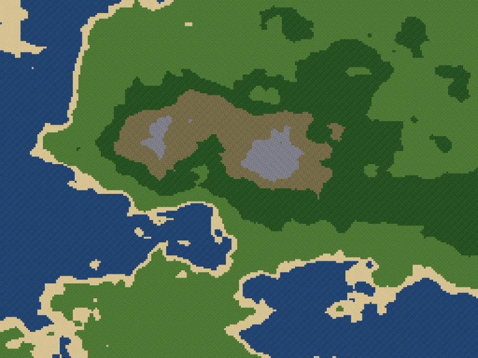

# Densitas

> A god game where belief is density.

<p align="center">
  
</p>

## What it is

Densitas is a top-down god game in the spirit of *Populous*, with one
distinguishing mechanic: **belief is a 2D density field, not a global mana bar.**
Citizens radiate a small aura of faith around themselves. Where they cluster,
belief intensifies. Where belief intensifies, the god can act. Where belief is
thin, the god is nearly powerless.

Total population determines which **tiers of godly power** are unlocked.
Local population density determines **how potent any given act of power can be
at a specific place**. A spell cast in the heart of your capital and the same
spell cast at the edge of the wilderness produce very different results.

The full design lives in [`Densitas_GDD.md`](Densitas_GDD.md); the belief-field
math in [`Densitas_belief.md`](Densitas_belief.md).

## The two gods

<table>
  <tr>
    <td width="50%" align="center">
      <br>
      <b>The Open Eye</b><br>
      <i>Order of the Witnessing</i>
    </td>
    <td width="50%" align="center">
      <br>
      <b>The Maw</b><br>
      <i>Order of the Hungry</i>
    </td>
  </tr>
  <tr>
    <td>
      <blockquote>What is not seen does not exist. The gaze of the god grants the world its reality.</blockquote>
    </td>
    <td>
      <blockquote>Hunger is the only honest emotion. To be devoured is to be made holy.</blockquote>
    </td>
  </tr>
</table>

Full theology, plus three more sketched gods (The Open Hand, The Numbering,
The Empty Throne) and a handful of heresies, in
[`Densitas_lore_pantheon.md`](Densitas_lore_pantheon.md).

## Status

| Milestone | State |
|-----------|-------|
| **P0 — Pixel world** (tile map, terrain, camera, debug HUD) | shipped |
| **P1 — Citizens exist** (16-tall pixel sprites, wander, reproduce) | shipped |
| **P2 — Belief field** (density grid, heatmap overlay, HUD readout) | shipped |
| **P1.5 — Food, forage & hunger** (tile food regen, carrying capacity) | shipped |
| P2.5 — Fog of war | next |
| **P3 — Powers T0–T1 + Religious Relics** (PR1 shipped: T0 + Bless/Curse + Pool + Scripture; PR2 terrain next; PR3 relics) | partial |
| P4 — Rival god AI | planned |
| P5 — Tiers T2–T4 (Tempest, Cataclysm, Apocalypse) | planned |
| P6 — Win/lose conditions + polish | planned |

Full backlog in [`TODO.md`](TODO.md); history of decisions in [`WORKLOG.md`](WORKLOG.md).

## Running it

Requires **Python 3.10+** (uses stdlib `tomllib` on 3.11+ and the `tomli`
backport on 3.10 — both declared in `requirements.txt`).

```bash
pip install -r requirements.txt
python -m densitas.main
```

On Windows, the helper scripts work too:

```cmd
start.cmd          REM activates .venv if present and runs the game
build.cmd          REM creates .venv, installs deps, runs tests
build.cmd --exe    REM same, then builds a one-file PyInstaller binary
build.cmd --clean  REM removes .venv, dist, build, *.spec
```

### A note on pygame-ce

Densitas uses **pygame-ce** (the community-edition fork) rather than upstream
pygame. The two are API-compatible — both ship as `import pygame` — but
pygame-ce is the actively-maintained fork and is the recommended choice for
new projects.

If you already have upstream `pygame` installed in your environment,
**uninstall it first** before installing pygame-ce; they share the `pygame`
namespace and cannot coexist:

```bash
pip uninstall pygame
pip install -r requirements.txt
```

To confirm which fork you're running: `pygame.IS_CE` is `1` on pygame-ce and
absent on upstream.

## Controls

- **WASD** / **arrow keys** — scroll the map
- **Mouse to screen edge** — edge-scroll
- **1** — Inspire mode (T0, cost 0)
- **2** — Calm mode (T0)
- **3** — Hunger Pang mode (T0, cost 1)
- **4** — Raise terrain (T1, PR2 — currently no-op stub)
- **5** — Lower terrain (T1, PR2 — currently no-op stub)
- **6** — Bless field (T1, cost 10, doubles food regen 30s)
- **7** — Curse field (T1, cost 10, food regen 20% 30s)
- **Left-click** — cast at the mouse tile (only while a mode is selected)
- **Right-click** / **ESC** (with mode selected) — cancel mode
- **F3** — toggle debug overlay
- **B** — toggle belief heatmap overlay
- **F** — toggle food heatmap overlay
- **ESC** (no mode selected) — quit

### Debug flags

- `--rival-stub-seed N` — spawn N faction-1 citizens at the canonical rival
  origin (3/4 across, mid-height). Exercises multi-faction codepaths
  (relic shatter, belief two-faction scatter) before P4 lands real rival AI.

  ```bash
  python -m densitas.main --rival-stub-seed 24
  ```

## Configuration

Every tunable parameter lives in [`config.toml`](config.toml). Edit a value,
restart the game. The schema is validated by `densitas/config.py`; a missing
or extra key raises a clear error at startup.

The most useful knobs:

| Key | Meaning |
|-----|---------|
| `world.seed` | Noise seed. Change for a new map. |
| `world.width`, `world.height` | Map shape in tiles (default 256x192). |
| `world.sea_level` … `world.mountain_thresh` | Biome cutoffs on the 0–1 heightmap. |
| `render.art_style` | `"pixel"` (active) or `"vector"` (planned). |
| `render.tile_size` | Pixels per tile at native zoom (default 16). |
| `citizen.initial_population` | How many citizens spawn at world load (default 8). |
| `citizen.lifespan_mean` | Mean lifespan in sim seconds (default 180). |
| `citizen.repro_cooldown` | Sim seconds between mate events (default 5). |
| `belief.grid_w`, `belief.grid_h` | Belief grid resolution (default 64x48). |
| `belief.amplitude` | Per-citizen splat magnitude. 1.0 -> `total == population`. |
| `belief.blur_passes` | Box-blur passes (default 2 -> sigma ≈ 1.4 cells). |
| `belief.overlay_alpha_max` | Peak alpha on the heatmap (0..255, default 180). |
| `food.hunger_rate` | Per-sim-sec hunger accrual. Default 0.05 -> 20s full->starving. |
| `food.repro_hunger_threshold` | Both mates must be below this (0..1) to reproduce. Default 0.30. |
| `food.biome.*_regen` | Per-biome food regeneration rate. Drives carrying capacity. |
| `powers.belief_regen_per_citizen` | Pool gain per citizen per sim sec (default 0.02). |
| `powers.k_tier` | Strength-scaling divisor per tier (T0..T4). Higher = weaker scaling. |
| `powers.bless_multiplier` / `curse_multiplier` | Food-regen multipliers for Bless / Curse (default 2.0 / 0.2). |
| `powers.effect_duration_t1` | How long Bless/Curse persist (default 30 sim sec). |
| `powers.relic.amplitude` | Per-relic belief contribution at full strength (default 20.0). |
| `powers.relic.shatter_ratio` / `shatter_time` | Rival belief ratio + sustained time to shatter (1.5 / 8.0 sim sec). |

## Project layout

```
densitas/
  __init__.py
  main.py          - entry point + game loop + input handling
  config.py        - dataclasses + TOML loader
  world.py         - heightmap + tile classification
  camera.py        - WASD/arrow/edge scroll + clamping
  render.py        - Renderer ABC + PixelRenderer (tiles, citizens, belief, food, cast preview)
  citizen.py       - Citizen + CitizenManager + tier lookup + inspire/rival hooks
  belief.py        - BeliefField (density grid + query API)
  food.py          - FoodField (per-tile food + regen + forage + effect folding)
  hud.py           - bottom-left card + pool bar + cooldown row + scripture log
  powers.py        - PowerKind, PowerSpec, PowerSystem, dispatch, ActiveEffect
  rhetoric.py      - JSON pool loader + weighted voice-mode picker
tests/
  test_world.py    - 8 tests
  test_citizen.py  - 11 tests
  test_belief.py   - 15 tests
  test_food.py     - 20 tests
  test_powers.py   - 20 tests (P3 PR1)
rhetoric.json      - scripture-log line pool keyed on (power, god, voice_mode)
config.toml        - all tunable parameters
entry.py           - PyInstaller bootstrap
start.cmd          - Windows: activate venv + run
build.cmd          - Windows: venv + deps + tests (+ optional --exe / --clean)
```

## Tone

The propaganda is the point. Every divine act emits a scripture-log line in
the god's chosen voice (consecration / doctrinal / ritual-procedural). The
numbers are for the player who wants to keep score; the rhetoric is for the
player who wants the god to feel divine.
